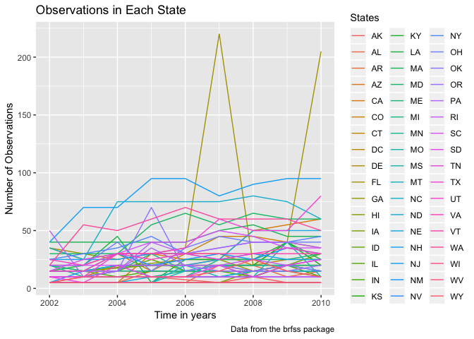

p8105\_hw3\_kb2977
================
Francois Ban
10/7/2018

Problem 1
---------

### Part 1: Loading brfss\_data and cleaning

1.  Format the data to use appropriate variable names
2.  Focus on the “Overall Health” topic
3.  Include only responses from “Excellent” to “Poor” (i.e. no pre-collapsed categories)
4.  Organize responses as a factor taking levels from “Excellent” to “Poor”
5.  Getting rid of unnecesary variables

``` r
devtools::install_github("p8105/p8105.datasets")
```

    ## Skipping install of 'p8105.datasets' from a github remote, the SHA1 (21f5ad1c) has not changed since last install.
    ##   Use `force = TRUE` to force installation

``` r
library(p8105.datasets)
data(brfss_smart2010)

brfss_data = 
  brfss_smart2010 %>% 
  janitor::clean_names() %>% 
  filter(topic == "Overall Health" & response == "Excellent" | response == "Poor" | response == "Very good" | response == "Fair") %>%
  mutate(response = as.factor(response)) %>% 
  select(-class, -topic, -question, -sample_size, -confidence_limit_low:-geo_location)
```

### Part 2: Answering following questions

Using the dataset above:

-   In 2002, which states were observed at 7 locations?

``` r
brfss_data_2002 = 
  brfss_data %>%
  spread(key = response, value = data_value) %>%
  filter(year == "2002") %>%
  count(locationabbr) %>% 
  filter(n == 7)
brfss_data_2002
```

    ## # A tibble: 3 x 2
    ##   locationabbr     n
    ##   <chr>        <int>
    ## 1 CT               7
    ## 2 FL               7
    ## 3 NC               7

-   Make a “spaghetti plot” that shows the number of observations in each state from 2002 to 2010.

``` r
state_plot = brfss_data %>% 
  group_by(locationabbr, year) %>% 
  summarize(n_obs = n()) %>%
  ggplot(aes(x = year, y = n_obs, color = locationabbr)) +
    geom_line()
state_plot
```



-   Make a table showing, for the years 2002, 2006, and 2010, the mean and standard deviation of the proportion of “Excellent” responses across locations in NY State.

``` r
table_data = 
  brfss_data %>%
  filter(year == "2002" | year == "2006" | year == "2010") %>% 
  filter(response == "Excellent") %>%
  filter(locationabbr == "NY") %>%
  group_by(year) %>%
  summarize(mean_ex = mean(data_value),
            sd_ex = sd(data_value)) %>%
  knitr::kable(digits = 1)
```

-   For each year and state, compute the average proportion in each response category (taking the average across locations in a state). Make a five-panel plot that shows, for each response category separately, the distribution of these state-level averages over time.

``` r
devtools::install_github("thomasp85/patchwork")
```

    ## Skipping install of 'patchwork' from a github remote, the SHA1 (fd7958ba) has not changed since last install.
    ##   Use `force = TRUE` to force installation

``` r
library(patchwork)
library(ggridges)
```

    ## 
    ## Attaching package: 'ggridges'

    ## The following object is masked from 'package:ggplot2':
    ## 
    ##     scale_discrete_manual

``` r
knitr::opts_chunk$set(
  fig.width = 6,
  fig.asp = .6,
  out.width = "90%"
)

av_prop_plot =
  brfss_data %>% 
  spread(key = response, value = data_value) %>% 
  group_by(year, locationabbr) %>% 
  summarize(av_prop_ex = mean(Excellent),
            av_prop_vg = mean(`Very good`),
            av_prop_fair = mean(Fair),
            av_prop_poor = mean(Poor))

av_prop_ex = av_prop_plot %>% 
  ggplot(aes(x = year, y = av_prop_ex, color = locationabbr)) +
  geom_line() +
  labs(
    title = "Distribution of State-Level Excellent Responses",
    x = "Time in years",
    y = "Average proportion of excellent responses",
    caption = "Data from the rnoaa package"
  )
av_prop_vg = av_prop_plot %>% 
  ggplot(aes(x = year, y = av_prop_vg, color = locationabbr)) +
  geom_line() +
  labs(
    title = "Distribution of State-Level Very Good Responses",
    x = "Time in years",
    y = "Average proportion of very good responses",
    caption = "Data from the brfss package"
  )
av_prop_fair = av_prop_plot %>% 
  ggplot(aes(x = year, y = av_prop_fair, color = locationabbr)) +
  geom_line() +
  labs(
    title = "Distribution of State-Level Fair Responses",
    x = "Time in years",
    y = "Average proportion of fair responses",
    caption = "Data from the brfss package"
  )

av_prop_poor = av_prop_plot %>% 
  ggplot(aes(x = year, y = av_prop_poor, color = locationabbr)) +
  geom_line() +
  labs(
    title = "Distribution of State-Level Poor Responses",
    x = "Time in years",
    y = "Average proportion of poor responses",
    caption = "Data from the brfss package"
  )

(av_prop_ex + av_prop_vg) / (av_prop_fair + av_prop_poor)
```

    ## Warning: Removed 3 rows containing missing values (geom_path).

    ## Warning: Removed 2 rows containing missing values (geom_path).

    ## Warning: Removed 1 rows containing missing values (geom_path).

    ## Warning: Removed 1 rows containing missing values (geom_path).


Problem 2
---------

``` r
data(instacart)
```

### Part 1: Exploration of instacart dataset

Directions: Write a short description of the dataset, noting the size and structure of the data, describing some key variables, and giving illstrative examples of observations.

-   

### Part 2: Answering questions using instacart\_data

1.  How many aisles are there, and which aisles are the most items ordered from?
2.  Make a plot that shows the number of items ordered in each aisle. Order aisles sensibly, and organize your plot so others can read it.
3.  Make a table showing the most popular item aisles “baking ingredients”, “dog food care”, and “packaged vegetables fruits”
4.  Make a table showing the mean hour of the day at which Pink Lady Apples and Coffee Ice Cream are ordered on each day of the week; format this table for human readers (i.e. produce a 2 x 7 table).

Problem 3
---------

``` r
data(ny_noaa)
```

### Part 1: Exploration of ny\_noaa dataset

Directions: Write a short description of the dataset, noting the size and structure of the data, describing some key variables, and indicating the extent to which missing data is an issue.

### Part 2: Answering questions using ny\_noaa datset

1.  Create separate variables for year, month, and day. Ensure observations for temperature, precipitation, and snowfall are given in reasonable units.

``` r
ny_noaa_data = 
  ny_noaa %>% 
  janitor::clean_names() %>% 
  separate(date, into = c("year", "month", "day"), sep = "-") %>% 
  mutate(prcp = as.numeric(prcp)/10)
```

For snowfall, the most commonly observed value was 0. This is because most days of the year, it does not snow.

1.  Make a two-panel plot showing the average temperature in January and in July in each station across years. Is there any observable / interpretable structure? Any outliers?
2.  Make a two-panel plot showing (i) tmax vs tmin for the full dataset (note that a scatterplot may not be the best option); and (ii) make a plot showing the distribution of snowfall values greater than 0 and less than 100 separately by year.
