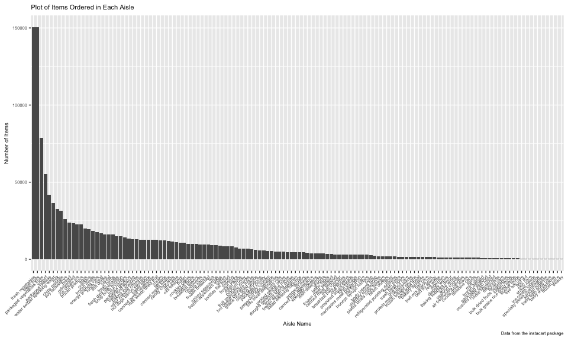

p8105\_hw3\_kb2977
================
Francois Ban
10/7/2018

Problem 1
---------

### Part 1: Loading brfss\_data and cleaning

1.  Format the data to use appropriate variable names
2.  Focus on the “Overall Health” topic
3.  Include only responses from “Excellent” to “Poor” (i.e. no pre-collapsed categories)
4.  Organize responses as a factor taking levels from “Excellent” to “Poor”
5.  Getting rid of unnecesary variables

``` r
library(tidyverse)
```

    ## ── Attaching packages ─────────────────────────────────────────────────────────── tidyverse 1.2.1 ──

    ## ✔ ggplot2 3.0.0     ✔ purrr   0.2.5
    ## ✔ tibble  1.4.2     ✔ dplyr   0.7.6
    ## ✔ tidyr   0.8.1     ✔ stringr 1.3.1
    ## ✔ readr   1.1.1     ✔ forcats 0.3.0

    ## ── Conflicts ────────────────────────────────────────────────────────────── tidyverse_conflicts() ──
    ## ✖ dplyr::filter() masks stats::filter()
    ## ✖ dplyr::lag()    masks stats::lag()

``` r
devtools::install_github("p8105/p8105.datasets")
```

    ## Skipping install of 'p8105.datasets' from a github remote, the SHA1 (21f5ad1c) has not changed since last install.
    ##   Use `force = TRUE` to force installation

``` r
library(p8105.datasets)
data(brfss_smart2010)

brfss_data = 
  brfss_smart2010 %>% 
  janitor::clean_names() %>% 
  filter(topic == "Overall Health" & response == "Excellent" | response == "Poor" | response == "Very good" | response == "Good" | response == "Fair") %>%
  mutate(response = as.factor(response)) %>% 
  select(-class, -topic, -question, -sample_size, -confidence_limit_low:-geo_location)
```

### Part 2: Answering following questions

Using the dataset above:

-   In 2002, which states were observed at 7 locations?

``` r
brfss_data_2002 = 
  brfss_data %>%
  spread(key = response, value = data_value) %>%
  filter(year == "2002") %>%
  count(locationabbr) %>% 
  filter(n == 7)
brfss_data_2002
```

    ## # A tibble: 3 x 2
    ##   locationabbr     n
    ##   <chr>        <int>
    ## 1 CT               7
    ## 2 FL               7
    ## 3 NC               7

-   Below is a “spaghetti plot” that shows the number of observations in each state from 2002 to 2010.

``` r
knitr::opts_chunk$set(
  fig.width = 10,
  fig.asp = .6,
  out.width = "100%"
  )

state_plot = brfss_data %>% 
  group_by(locationabbr, year) %>% 
  summarize(n_obs = n()) %>%
  ggplot(aes(x = year, y = n_obs, color = locationabbr)) +
    geom_line() +
    labs(
        title = "Observations in Each State",
        x = "Time in Years",
        y = "Number of Observations",
        caption = "Data from the brfss package"
    ) +
    scale_color_hue(name = "States")
state_plot
```


-   Below is a table showing, for the years 2002, 2006, and 2010, the mean and standard deviation of the proportion of “Excellent” responses across locations in NY State.

``` r
table_data = 
  brfss_data %>%
  filter(year == "2002" | year == "2006" | year == "2010") %>% 
  filter(response == "Excellent") %>%
  filter(locationabbr == "NY") %>%
  group_by(year) %>%
  summarize(mean_ex = mean(data_value),
            sd_ex = sd(data_value)) %>%
  knitr::kable(digits = 1)
```

-   Below is a five-panel plot that shows, for each response category separately, the distribution of state-level averages over time.

``` r
library(patchwork)
library(ggridges)
```

    ## 
    ## Attaching package: 'ggridges'

    ## The following object is masked from 'package:ggplot2':
    ## 
    ##     scale_discrete_manual

``` r
av_prop_plot =
  brfss_data %>% 
  spread(key = response, value = data_value) %>% 
  group_by(year, locationabbr) %>% 
  summarize(av_prop_excellent = mean(Excellent),
            av_prop_verygood = mean(`Very good`),
            av_prop_good = mean(Good),
            av_prop_fair = mean(Fair),
            av_prop_poor = mean(Poor)) %>% 
  gather(key = response, value = mean, av_prop_excellent:av_prop_poor) %>% 
  separate(response, into = c("remove_1", "remove_2", "response"), sep = "_") %>% 
  select(-remove_1,-remove_2) %>% 
  mutate(response = forcats::fct_relevel(response, c("excellent", "verygood", "good", "fair", "poor"))) %>% 
  ggplot(aes(x = year, y = mean)) +
    geom_violin(aes(), color = "blue", alpha = .5) +
    facet_grid(~response) +
    labs(
        title = "Distribution of State-Level Responses",
        x = "Time in years",
        y = "Average proportion of responses",
        caption = "Data from the rnoaa package"
    )
av_prop_plot
```

    ## Warning: Removed 21 rows containing non-finite values (stat_ydensity).


Problem 2
---------

``` r
data(instacart)
```

### Part 1: Exploration of instacart dataset

Directions: Write a short description of the dataset, noting the size and structure of the data, describing some key variables, and giving illustrative examples of observations.

-   The following variables were included in this dataset: add\_to\_cart\_order, aisle, aisle\_id, days\_since\_prior\_order, department, department\_id, eval\_set, order\_dow, order\_hour\_of\_day, order\_id, order\_number, product\_id, product\_name, reordered, user\_id.
-   The dataset consists of 1384617 rows (observations) and 15 columns (variables).
-   The dataset included useful information about the customer, the order, and the products of interest.
-   There were 131209 orders placed.
-   The average number of items ordered in this dataset was 10.5527593.
-   The user\_id with the most orders was 149753.
-   The most ordered item was Banana.
-   Customers tend to place orders around the 14 hour of the day.

### Part 2: Answering questions using instacart\_data

-   How many aisles are there, and which aisles are the most items ordered from? There were a total of 134 aisles.

-   The following aisles had the most items ordered:

| aisle                      |       n|
|:---------------------------|-------:|
| fresh fruits               |  150473|
| fresh vegetables           |  150609|
| packaged cheese            |   41699|
| packaged vegetables fruits |   78493|
| yogurt                     |   55240|

-   Below is a plot that shows the number of items ordered in each aisle. Order aisles sensibly, and organize your plot so others can read it. mutate(aisle\_id = forcats::fct\_reorder(aisle\_id, desc(n)))

``` r
items_ordered = 
  instacart %>% 
  count(aisle) %>%
  mutate(aisle = forcats::fct_reorder(aisle, desc(n))) %>% 
  ggplot(aes(x = aisle, y = n)) +
  geom_bar(stat = "identity") +
  theme(axis.text.x = element_text(angle = 45, hjust = 1), text = element_text(size = 7)) +
  labs(
      title = "Plot of Items Ordered in Each Aisle",
      x = "Aisle Name",
      y = "Number of Items",
      caption = "Data from the instacart package"
  )
items_ordered
```



-   Below is a table showing the top 3 popular items in the aisles “baking ingredients”, “dog food care”, and “packaged vegetables fruits”.

``` r
pop_item = 
  instacart %>% 
  filter(aisle == "baking ingredients" | aisle == "dog food care" | aisle == "packaged vegetables fruits") %>% 
  group_by(aisle) %>% 
  count(product_name) %>% 
  top_n(3) %>% 
  knitr::kable(digits = 1)
```

    ## Selecting by n

``` r
pop_item
```

| aisle                      | product\_name                                 |     n|
|:---------------------------|:----------------------------------------------|-----:|
| baking ingredients         | Cane Sugar                                    |   336|
| baking ingredients         | Light Brown Sugar                             |   499|
| baking ingredients         | Pure Baking Soda                              |   387|
| dog food care              | Organix Chicken & Brown Rice Recipe           |    28|
| dog food care              | Small Dog Biscuits                            |    26|
| dog food care              | Snack Sticks Chicken & Rice Recipe Dog Treats |    30|
| packaged vegetables fruits | Organic Baby Spinach                          |  9784|
| packaged vegetables fruits | Organic Blueberries                           |  4966|
| packaged vegetables fruits | Organic Raspberries                           |  5546|

-   Below is a table showing the mean hour of the day at which Pink Lady Apples and Coffee Ice Cream are ordered on each day of the week; format this table for human readers (i.e. produce a 2 x 7 table).

``` r
mean_hour_table = 
  instacart %>% 
  filter(product_name == "Pink Lady Apples" | product_name == "Coffee Ice Cream") %>%
mutate(order_dow = recode_factor(order_dow, "0" = "Sunday", 
                             "1" = "Monday", 
                             "2" = "Tuesday", 
                             "3" = "Wednesday", 
                             "4" = "Thursday", 
                             "5" = "Friday", 
                             "6" = "Saturday"
                             )
         ) %>% 
  group_by(order_dow, product_name) %>% 
  summarize(mean_hr = mean(order_hour_of_day)) %>%
  spread(key = order_dow, value = mean_hr) %>% 
  knitr::kable(digits = 1)
mean_hour_table
```

| product\_name    |  Sunday|  Monday|  Tuesday|  Wednesday|  Thursday|  Friday|  Saturday|
|:-----------------|-------:|-------:|--------:|----------:|---------:|-------:|---------:|
| Coffee Ice Cream |    13.8|    14.3|     15.4|       15.3|      15.2|    12.3|      13.8|
| Pink Lady Apples |    13.4|    11.4|     11.7|       14.2|      11.6|    12.8|      11.9|

Problem 3
---------

``` r
data(ny_noaa)
```

### Part 1: Exploration of ny\_noaa dataset

Directions: Write a short description of the dataset, noting the size and structure of the data, describing some key variables, and indicating the extent to which missing data is an issue.

-   The following variables were included in this dataset: date, id, prcp, snow, snwd, tmax, tmin.
-   The dataset consists of 2595176 rows (observations) and 7 columns (variables).
-   The dataset included useful information about the weather station, date, temperature, precipitation, and snowfall.
-   There were 10957 dates in which weather was observed.
-   Weather information was gathered from 747 distinct stations.
-   Because weather stations collect only a subset of variables, there is a lot of missing data. We need to keep this in mind when creating graphs that describe the datset as it will get rid of any rows containing non-finite values (i.e. NA).

### Part 2: Answering questions using ny\_noaa datset

-   Create separate variables for year, month, and day. Ensure observations for temperature, precipitation, and snowfall are given in reasonable units.

``` r
ny_noaa_clean = 
  ny_noaa %>% 
  janitor::clean_names() %>% 
  separate(date, into = c("year", "month", "day"), sep = "-") %>% 
  mutate(prcp = as.numeric(prcp)/10,
         tmax = as.numeric(tmax)/10,
         tmin = as.numeric(tmin)/10
         )
```

For snowfall, the most commonly observed value was 0. This is because most days of the year, it does not snow.

-   Make a two-panel plot showing the average max temperature in January and in July in each station across years. Is there any observable / interpretable structure? Any outliers?

``` r
ave_temp = 
  ny_noaa_clean %>% 
  filter(month == "01" | month == "07") %>% 
  mutate(month = recode(month, "01" = "January", "07" = "July")) %>% 
  group_by(month, id, year) %>% 
  summarize(ave_max_temp = mean(tmax)) %>% 
  ggplot(aes(x = year, y = ave_max_temp)) +
  geom_hex() +
  facet_grid(~month) +
  theme(axis.text.x = element_text(angle = 45, hjust = 1), text = element_text(size = 9)) +
  labs(
      title = "Average Maximum Temperature in January and July",
      x = "Time in Years",
      y = "Average Maximum Temperature (Celcius)",
      caption = "Data from the ny_noaa package"
  ) 
ave_temp
```

    ## Warning: Removed 7058 rows containing non-finite values (stat_binhex).


When looking at the hexigon plot created above, it is evident that the average maximum temperature for January is centered around 0 degrees Celcius across years and whereas for July, it seems to be centered around 27 degrees Celcius. In both months, there are a couple of outliers (1982 in January and 1988 in July) in which the average maximum temperature dips and is very low compared to the rest of the data.

-   Make a two-panel plot showing (i) tmax vs tmin for the full dataset (note that a scatterplot may not be the best option); and (ii) make a plot showing the distribution of snowfall values greater than 0 and less than 100 separately by year.

``` r
devtools::install_github("thomasp85/patchwork")
```

    ## Skipping install of 'patchwork' from a github remote, the SHA1 (fd7958ba) has not changed since last install.
    ##   Use `force = TRUE` to force installation

``` r
temp_plot = 
  ny_noaa_clean %>% 
  ggplot(aes(x = tmax, y = tmin)) +
  geom_hex() +
  labs(
      title = "Plot of Maximum vs. Minimum Temperature",
      x = "Maximum Temperature in Celcius",
      y = "Minimum Temperature in Celcius",
      caption = "Data from the ny_noaa package"
  ) 

snowfall_plot = 
  ny_noaa_clean %>% 
  filter(snow < 100 & snow > 0) %>% 
  ggplot(aes(x = snow, y = year)) +
  geom_density_ridges(alpha = .5, color = "blue", scale = 0.85) +
  labs(
      title = "Distribution of Snowfall by Year",
      x = "Snowfall (mm)",
      y = "Time in Years",
      caption = "Data from the ny_noaa package"
  ) 

temp_plot + snowfall_plot
```

    ## Warning: Removed 1136276 rows containing non-finite values (stat_binhex).

    ## Picking joint bandwidth of 3.76


